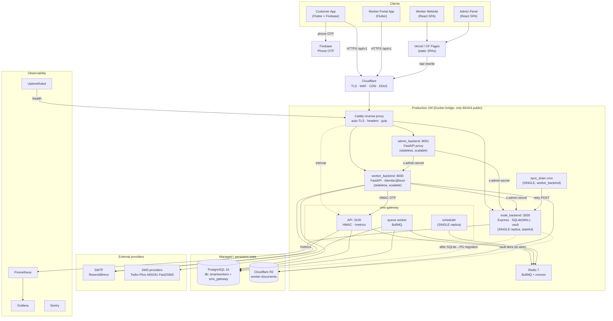

# Infrastructure Diagram

> Reflects the real service set (including `sms-gateway` + Redis, which the root
> `docker-compose.yml` currently omits) and the verified communication paths.

## Mermaid



## ASCII (fallback)

```
                       Customer App   Worker App      Worker Website   Admin Panel
                        (Flutter)      (Flutter)        (React SPA)     (React SPA)
                           |  \           |                  |              |
                    Firebase   \          |              Vercel/Pages (CDN, /api rewrite)
                    phone OTP    \         |                  |              |
                           HTTPS  v        v                  v              v
                          ┌────────────────────── Cloudflare (TLS/WAF/CDN/DDoS) ───────────┐
                          └───────────────────────────────┬───────────────────────────────┘
                                                          443
        ┌──────────────────────────── Production VM (only 80/443 public) ──────────────────┐
        │                              Caddy reverse proxy                                  │
        │        api.* ──┐        workers-api.* ──┐     admin-api.* ──┐   (sms internal)    │
        │                v                        v                   v                      │
        │        node_backend:3000        worker_backend:8000   admin_backend:8001          │
        │        Express + SQLite          FastAPI + Alembic     FastAPI (stateless)        │
        │        + in-mem vault            + boto3(R2)               proxy                   │
        │        SINGLE replica            stateless/scalable    │  │                        │
        │            ^   ^                   │   │   │           │  │                        │
        │   x-admin- │   └─ x-admin ─────────┘   │   └─ HMAC OTP ┘  │                        │
        │   secret   └──────── x-admin (admin→node) ───────────────┘                        │
        │                                     │                                              │
        │     sync_drain (cron, single) ──────┘        sms-gateway: API:3100 + worker +      │
        │                                              scheduler(single)  ── Redis 7         │
        └───────────────┬──────────────────────────────┬───────────────────┬────────────────┘
                        │                               │                   │
                 PostgreSQL 16                   Cloudflare R2          SMTP / SMS APIs
              (smartworkers, sms_gateway)      (worker documents)     (Resend; Twilio/MSG91…)
```

### Legend / key constraints shown
- **SINGLE replica** boxes (node_backend, sms-gateway scheduler, sync_drain) must never be horizontally scaled.
- Dotted lines = **planned/to-wire** (node_backend → Postgres after migration; node_backend vault → R2).
- Internal calls (`x-admin-secret`, HMAC) never leave the bridge network.
